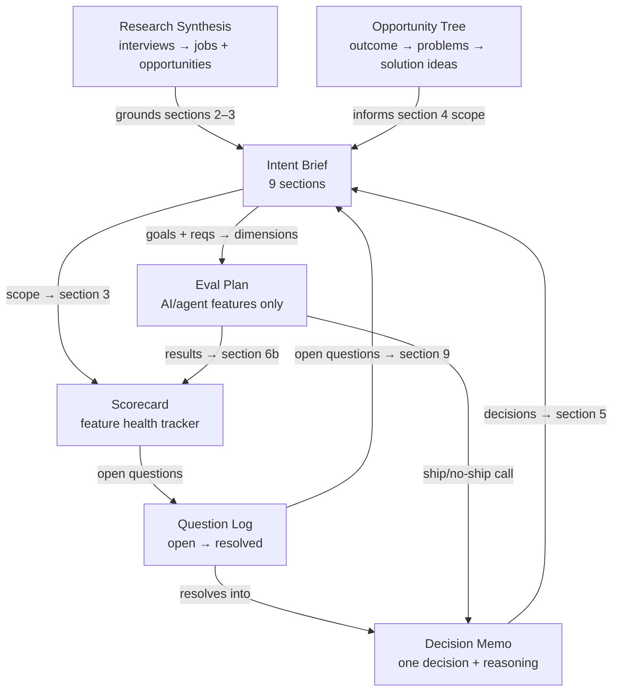
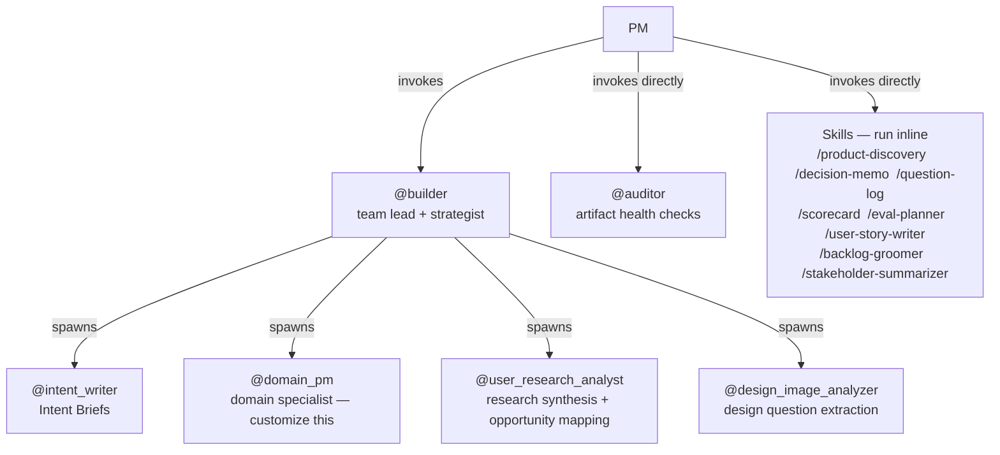

# Riff

In agentic coding, the developer stopped writing every line of code. They became a technical director - describing intent, reviewing output, making judgment calls. The code still gets written. The developer's job fundamentally changed.

The same shift is happening in product management. Riff is a working implementation of what that looks like.

---

## What This Is

Most "AI for PM" is prompt-and-paste. Ask Claude to summarize a transcript. Ask it to draft a PRD. Copy the output, edit it manually, move on. The PM still drives every step.

Riff is different. It's an architecture for agentic PM work - where a team of specialized agents handles the information-dense, consistency-checking, artifact-producing work, while the PM focuses on what only a human can do: judgment, strategy, and the decisions that no framework captures.

The core insight: PM work follows the same pattern as agentic coding. A team lead (`@builder`) coordinates specialists (`@user_research_analyst`, `@intent_writer`, `@domain_pm`, `@design_image_analyzer`), each producing artifacts that feed the next. The PM stays in the loop at decision points — not to produce documents, but to make calls. Agents draft. PMs decide.

---

## What Led to This

PM artifacts today serve two purposes, and do both poorly:

1. **Thinking tool** — forces the PM to clarify their own thinking
2. **Communication tool** — aligns others on what to build and why

In an agentic world, a third purpose emerges:

3. **Agent context** — gives agents enough structured information to do useful downstream work: generating specs, writing stories, tracking dependencies

Current PRDs are optimized for purpose 2 and accidentally serve purpose 1. They're bad at purpose 3 — too much prose, too little structure, too many implicit assumptions. An agent reading a traditional PRD can't reliably extract what's in scope, what tradeoffs were made, or what decisions are still open.

That's what prompted the 6-artifact redesign. Each artifact is structured so the judgment parts are clearly separated from the information-compilation parts. Agents handle the latter. PMs own the former.

---

## The Three Levels of Agentic PM

Most "AI for PM" work today is Level 1. Riff targets Level 2, with infrastructure for Level 3.

**Level 1 - Tool Use** (where most teams are today)

"Summarize this transcript." "Write a PRD draft." "Generate user stories."

Useful, but not agentic. The PM still drives every step manually.

**Level 2 - Autonomous Workflows** (where Riff operates)

PM says: "We had a design review for the notification center. Here's the transcript and three Figma screenshots."

The agent then:
1. Extracts open questions from the transcript
2. Analyzes the mockups for missing states and edge cases
3. Cross-references against existing requirements docs
4. Identifies gaps between what was discussed and what's documented
5. Drafts updated user stories for the decided items
6. Flags unresolved decisions with enough context for the PM to make the call

The PM shifted from doing the work to directing the work and making the hard calls.

**Level 3 - Persistent Context** (the frontier Riff enables)

Agents that maintain an evolving understanding of the product and surface the right questions before anyone thinks to ask them. The Context File and artifact-linking system in Riff are the foundation for this.

---

## The 6-Artifact System

All PM work produces one of 6 artifact types:

| Artifact | What It Is | PM writes | Agent handles |
|----------|-----------|-----------|---------------|
| **Decision Memo** | One decision and its reasoning. The atomic unit of PM judgment. | Everything - this is the PM's job | Flags when assumptions change |
| **Intent Brief** | PM writes intent (sections 1-5), agent generates spec (6-9). | Sections 1-5: problem, goals, constraints, scope | Sections 6-9: spec, stories, dependencies |
| **Context File** | Living domain background that agents read to stay grounded. | Anti-patterns, terminology, ownership | Document indexing, staleness detection |
| **Question Log** | Tracks open questions from raised to resolved. | Resolutions and judgment calls | Extraction from transcripts, status tracking |
| **Scorecard** | Living feature health tracker updated on cadence. | Health assessment | Counting, risk flagging, metric tracking |
| **Eval Plan** | Dimensions, rubrics, and ship criteria for AI/agent features. | Ship/no-ship judgment calls | Dimension drafting, threshold tracking, result recording |

Two artifacts deserve emphasis:

**Decision Memo** is the one artifact agents genuinely cannot produce. Everything else is downstream of human judgment — this is where that judgment lives. Agents can flag when assumptions change, but they can't make the call. It's small, frequent, and unambiguous. That's the point.

**Intent Brief** is the flip. Today's PRD is 80% context compilation — requirements, user flows, edge cases — and 20% judgment. The Intent Brief inverts that ratio. The PM writes the 20% that matters (sections 1-5: problem, goals, constraints, scope). The agent generates the 80% (sections 6-9: spec, stories, dependencies). The PM reviews and corrects; they don't draft from scratch.

How the hierarchy works:
- **Decision Memo** is the atomic unit - small, frequent, captures actual PM judgment
- **Intent Brief** is the container - stitches decisions into a coherent feature plan
- **Context File, Question Log, and Scorecard** are infrastructure - they make the first two work better over time and turn one-shot interactions into a persistent, context-aware system

How they connect: see [Artifact Flow](#artifact-flow) below.

---

## Agent Architecture

```
@builder (team lead)
├── @intent_writer          - writes Intent Briefs (PM Intent + Agent Spec)
├── @domain_pm              - domain specialist (you customize this)
├── @design_image_analyzer  - extracts questions from Figma mockups
├── @user_research_analyst  - synthesizes interviews, builds opportunity trees
└── @auditor                - on-demand artifact health checks (invoke directly)
```

`@builder` handles strategy directly — competitive analysis, build-vs-buy, roadmap, metrics — and spawns teammates for focused deliverables.

`@domain_pm` is a template agent. You fill it in with your product's domain knowledge — feature areas, constructs, key docs — and it becomes a grounded specialist for your product.

`@user_research_analyst` handles the discovery phase. Give it interview notes and it extracts jobs, struggle patterns, and opportunities. It can build and update an opportunity solution tree, and map assumptions before you write a spec. Output feeds Intent Brief sections 2 and 3 directly.

`@auditor` is invoked on demand. Run `@auditor [feature name]` to check a single feature's artifacts for drift, broken references, and gaps. Run `@auditor [system]` for a cross-feature sweep before sprint reviews or roadmap planning.

Skills run inline: `/product-discovery`, `/decision-memo`, `/question-log`, `/scorecard`, `/eval-planner`, `/user-story-writer`, `/backlog-groomer`, `/stakeholder-summarizer`, `/extract-transcript`.

---

## How Everything Fits Together

### The PM Lifecycle

Riff maps to six stages of PM work. Each stage has a dedicated tool and produces a specific artifact.

| Stage | When | Agent or Skill | Artifact |
|-------|------|---------------|----------|
| **Discover** | Before writing a feature brief | `@user_research_analyst`, `/product-discovery` | Research synthesis, opportunity tree |
| **Plan** | Writing the PM's view of a feature | `@builder`, `@intent_writer [intent]`, `/decision-memo` | Intent Brief (sections 1–5), Decision Memos |
| **Spec** | Generating engineering-ready requirements | `@intent_writer [spec]`, `/user-story-writer`, `/backlog-groomer` | Intent Brief (sections 6–9) |
| **Validate** | Evaluating AI/agent features before ship | `/eval-planner` | Eval Plan |
| **Track** | Monitoring feature health on cadence | `/scorecard`, `/question-log` | Scorecard, Question Log |
| **Review** | Auditing before sprint review or roadmap | `@auditor` | Audit report |

### Artifact Flow

How artifacts feed each other:



### Agent Relationships



### What the PM Owns vs. What Agents Handle

The split is consistent across every artifact: PM provides judgment, agents handle compilation.

| What the PM writes | What agents generate |
|--------------------|---------------------|
| Intent Brief sections 1–5: problem, goals, scope | Intent Brief sections 6–9: requirements, stories, dependencies |
| Decision Memos: the actual decision and reasoning | Flags when assumptions embedded in decisions have changed |
| Question Log resolutions: the judgment call | Extraction from transcripts, status tracking, priority sorting |
| Scorecard health rating | Metric counts, risk flags, drift detection |
| Eval Plan ship/no-ship call | Dimension drafting, threshold tracking, score recording |
| Research agenda: who to talk to, what to test | JTBD synthesis, opportunity trees, assumption maps |

---

## Getting Started

### 1. Clone the repo

```bash
git clone https://github.com/kvssptj/riff.git
cd riff
```

Open the folder in Claude Code.

### 2. Customize `@domain_pm`

Edit `.claude/agents/domain_pm.md`. Fill in the Domain Expertise section with your product's feature areas, coverage model, key reference docs, and user personas.

This is the only file that's truly project-specific. Everything else works out of the box.

### 3. Try your first workflow

**Capture a decision:**
```
/decision-memo [evaluate] Should we build our own search or use a third-party library?
```

**Start from research:**
```
@user_research_analyst Here are notes from 4 customer interviews. Extract the jobs and surface the top opportunities.
```

**Write a feature brief:**
```
@intent_writer Write an Intent Brief for [your feature].
```

**Chain a full pipeline:**
```
@builder Here are 6 customer interviews and a design transcript. Synthesize the research, extract questions into a Question Log, and start an Intent Brief.
```

---

## Directory Structure

```
riff/
├── README.md
├── CLAUDE.md                           # Agent + skill routing guide
├── .claude/
│   ├── agents/
│   │   ├── builder.md                  # PM team lead
│   │   ├── domain_pm.md                # Domain specialist - customize this
│   │   ├── intent_writer.md            # Intent Brief specialist
│   │   ├── design_image_analyzer.md    # Design mockup analysis
│   │   ├── user_research_analyst.md    # JTBD synthesis and opportunity mapping
│   │   └── auditor.md                  # On-demand artifact health checks
│   └── skills/
│       ├── product-discovery/SKILL.md  # JTBD interviews, synthesis, opportunity trees
│       ├── backlog-groomer/SKILL.md    # RICE/ICE/Kano prioritization
│       ├── decision-memo/SKILL.md      # Decision documentation
│       ├── eval-planner/SKILL.md       # Eval plans, rubrics, ship criteria
│       ├── humanized-writing/SKILL.md  # Writing style enforcement
│       ├── product-mece/SKILL.md       # MECE framework for product thinking
│       ├── question-log/SKILL.md       # Question tracking
│       ├── scorecard/SKILL.md          # Feature health tracking
│       ├── stakeholder-summarizer/SKILL.md  # Exec summaries and status updates
│       └── user-story-writer/SKILL.md  # Sprint-ready user stories
└── Docs/
    ├── Sprint_Planning_Template.md     # Sprint planning document
    └── PRDdocs/
        ├── intent_brief_template.md    # 9-section Intent Brief template
        ├── decision_memo_template.md   # 7-section Decision Memo template
        ├── eval_plan_template.md       # 6-section Eval Plan template
        ├── question_log_template.md    # Question Log template
        ├── scorecard_template.md       # Scorecard template
        ├── prd_template.md             # Legacy PRD (reference only)
        └── examples/                   # Fictional Acme Corp examples
            ├── EXAMPLE_intent_brief.md
            ├── EXAMPLE_decision_memo.md
            ├── EXAMPLE_context_file.md
            ├── EXAMPLE_eval_plan.md
            ├── EXAMPLE_question_log.md
            └── EXAMPLE_scorecard.md
```

---

## Key Concepts

**Intent Brief vs. PRD**

A traditional PRD is 80% context compilation and 20% judgment. The Intent Brief flips that. The PM writes sections 1-5 - the problem, goals, constraints, and scope - pure judgment work. The agent generates sections 6-9 - requirements, stories, dependencies, open questions. The PM reviews and corrects but doesn't draft from scratch.

**Decision Memo as atomic unit**

Every significant product decision gets its own 7-section memo: Situation, Decision, Why This Not That, What This Unlocks, What This Closes Off, Constraints, Open Threads. Small format, big discipline. Decisions get referenced in Intent Briefs, tracked in Scorecards, and linked from Question Logs.

**Context File**

Think of it as onboarding docs for your agents. Your `@domain_pm` reads this to understand your product before producing any artifact. Without it, agents start cold every session. With it, they ground every claim in your real product context. This is what makes Level 3 possible.

**Anti-shallow rules**

Every agent and skill enforces the same standard: ground every claim, at least one concrete example per section, no buzzwords, depth over breadth, consistent numbering for traceability.

**Critical Thinking Triggers**

Agents don't just produce artifacts — they push back. `@builder` and `@intent_writer` have built-in red flags that fire before proceeding: unmeasurable goals, scope without rationale, priority claims with no trade-off, "quick wins" with no opportunity cost analysis. The agent surfaces the question the PM didn't know to ask.

**Memory**

`@builder` and `@domain_pm` save learnings that accumulate value across conversations — competitive signals, recurring customer patterns, outcome data, failed hypotheses. This is the mechanism for Level 3: agents that know your product's history, not just its current state.

---

## Philosophy

### The Coding Parallel

In agentic coding, the shift looks like this:

| Before | After |
|--------|-------|
| Developer writes every line | Developer describes intent, reviews output |
| Manual file-by-file exploration | Agent explores codebase autonomously |
| Human holds all context in their head | Agent reads docs, tests, and code to build context |
| Sequential: write, test, fix, repeat | Agent runs the loop, surfaces results |
| One person, one task at a time | Agent spawns parallel workers for independent tasks |

The developer didn't become unnecessary. They became a technical director - setting intent, making judgment calls, approving work, and handling the ambiguous stuff.

### The Structural Parallel

PM work follows the same pattern:

| Agentic Coding | Agentic PM |
|----------------|------------|
| Codebase as context | Documentation corpus as context |
| Tests as ground truth | Requirements and confirmed scope as ground truth |
| Compiler errors = hard failures | Inconsistencies between docs = soft failures |
| explore, plan, implement, test | research, analyze, draft, validate |
| Agent spawns sub-agents for parallel tasks | PM lead agent spawns specialist agents |
| Human approves PRs | Human approves decisions |
| CI/CD catches regressions | Agent catches spec drift and stale docs |

### What's Actually Different

The honest gap: code has a compiler. Product decisions don't.

In coding, you can verify correctness — tests pass, types check, the app runs. In PM work, quality is judgment-based. A PRD can be internally consistent but strategically wrong. A prioritization can follow a perfect RICE framework and still miss the point. There's no green checkmark for a good strategy call.

This is why "agents do PM" is the wrong framing. Agents can't tell you whether to build feature A or feature B. They can tell you what's inconsistent, what's missing, and what questions are still open. That's a lot — but it's not judgment.

So the future state is: agents handle the information-heavy, consistency-checking, artifact-producing work — and the PM focuses entirely on judgment, strategy, stakeholder alignment, and the messy human stuff no framework captures.

The PM becomes less of a document producer and more of a decision-maker with perfect context. Which, honestly, is what the role was always supposed to be.

---

## Contributing

PRs welcome. The most valuable contributions:
- New skill definitions for common PM workflows
- Improvements to the Intent Brief or Decision Memo templates
- Better examples (keep them fictional - no real company data)
- Improvements to `@domain_pm` to make customization easier
